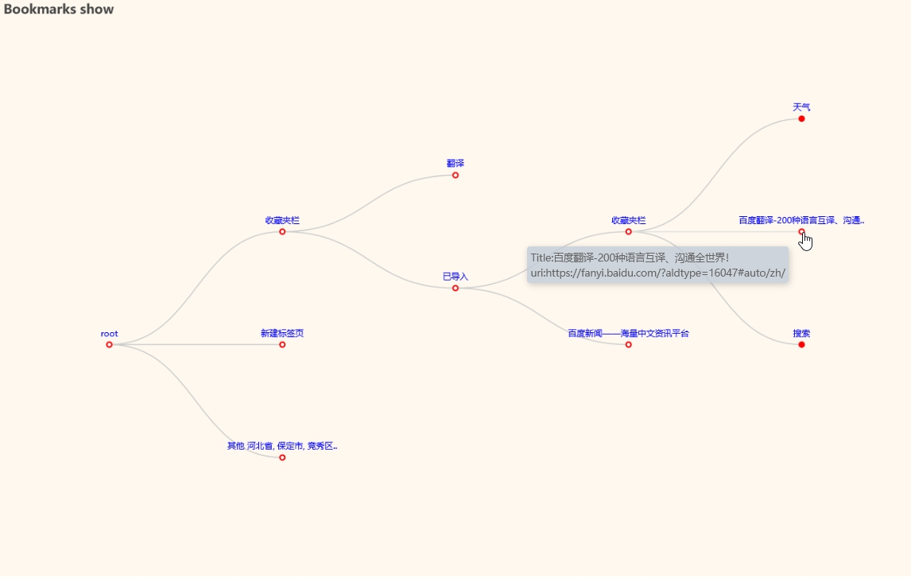
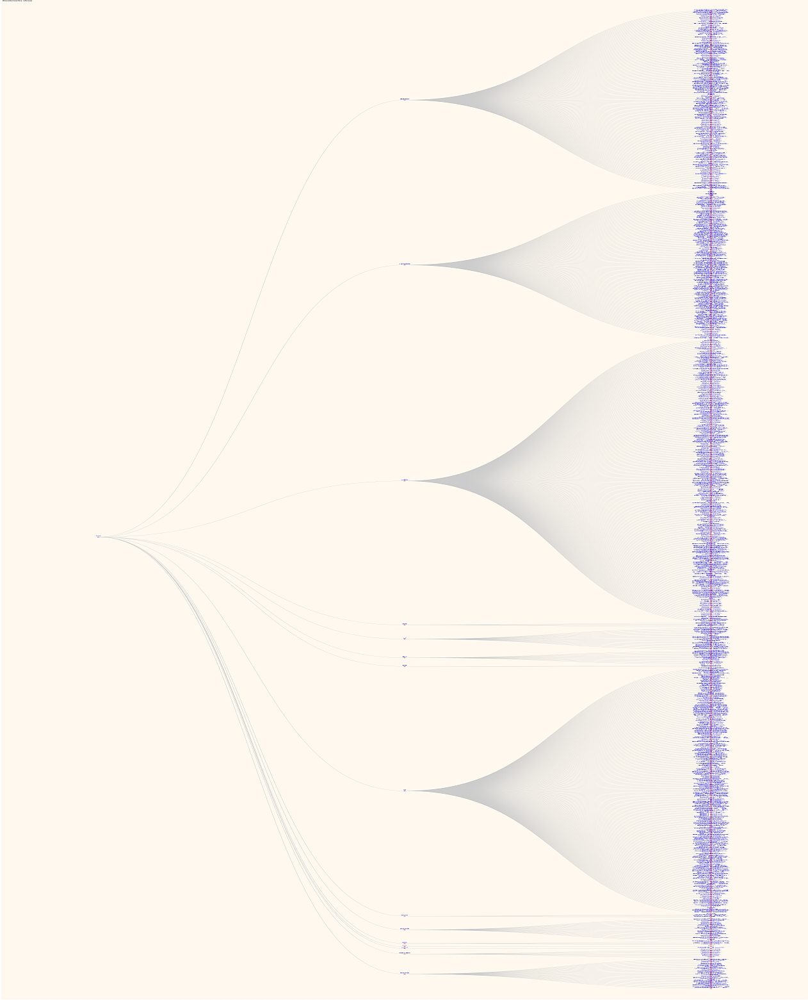

# Bookmark Show

Show the browser's bookmarks with a tree diagram.

## Function

Generate html file or image file to show bookmark content by browser exported html bookmark file.

View with browser, it will show a tree diagram, if there are folders inside the bookmark, you can expand or collapse the folders

- Currently supported browsers: IE, edge, Firefox, chrome.

## Effect

- Show Effect

- Expand

- Personal effect of nearly 1500 bookmarks

## Usage

`show_bookmark_tree.py` in the `src` directory are available for reference use.

`simple_show()` and `echar_show()` in `bmtree.py`
