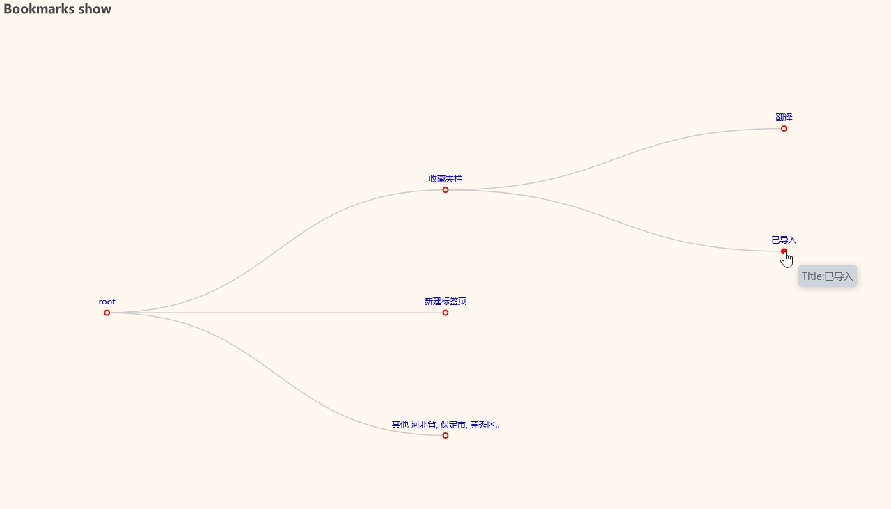
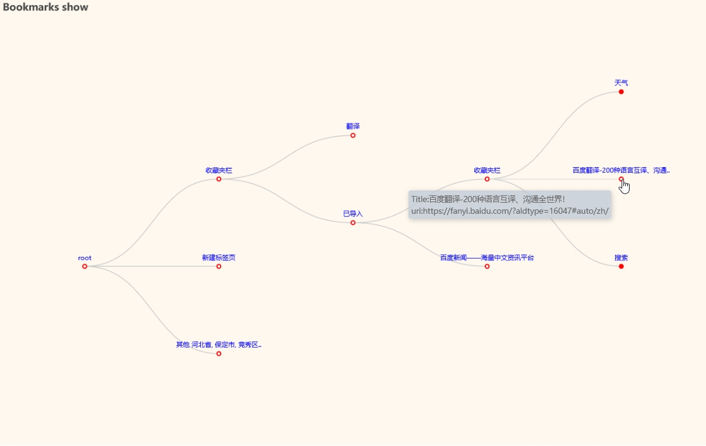
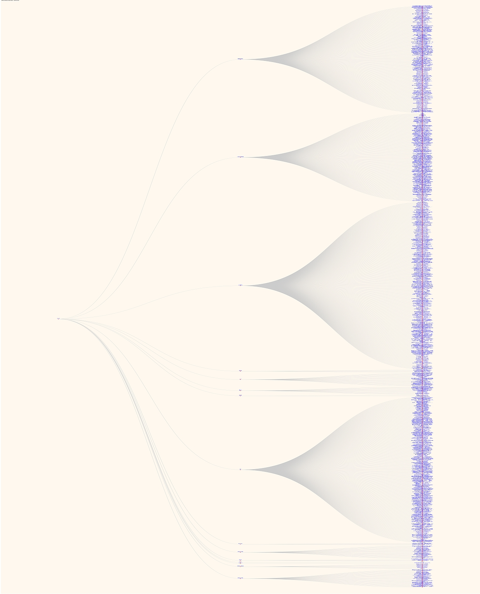

# 书签秀

用树状图来展现浏览器的书签。

## 功能

通过处理浏览器导出的html书签文件，生成html文件或图片文件，来展示书签内容。
用浏览器查看，会显示树状图，如果书签里面有文件夹，可以展开或收起文件夹。

- 目前支持IE，edge，Firefox，chrome的书签导出为html格式的文件

## 效果

- 展现效果

- 展开

- 个人的近1500书签效果


## 具体用法

`src`目录下的`show_bookmark_tree.py`可供参考使用。

`bmtree.py`里的`simple_show()`和`echar_show()`

```python
outfile = simple_show()
outfile = simple_show(infile='tests/bookmarks_firefox.html',
                      outfile='outdata/show_bookmarks_firefox.html')
outfile = echar_show(infile='tests/bookmarks_edge.html',
                     outfile='outdata/show_bookmarks_edge.html', is_cdn_jsdelivr=True)
```
